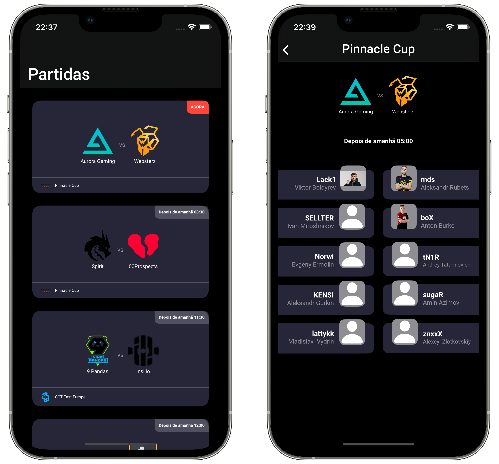
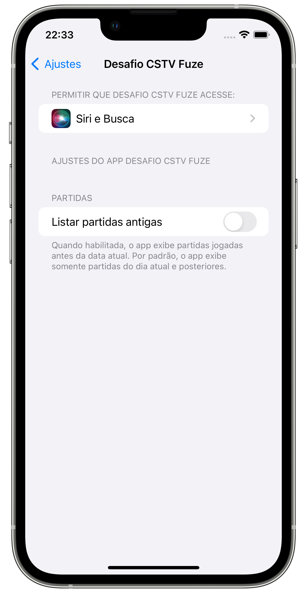

# Desafio CSTV Fuse

## Implemented Items:

 - Main app screens (Matches and details)
 - Pull down to refresh functionality
 - Sort by currently running, from current date
 - Passive error handling

 ## Extras:

 - MVVM Architecture
 - Pagination
 - Reactive Programming (via RxSwift)
 - Responsiveness (Tested on iPhone SE 1st Gen - XCode Simulator)

 ## Also included:

 - Toggle to enable past matches. When enabled, the pagination will not filter matches that already occurred in past dates considering the current one. This toggle can be found under the device settings > Desafio CSTV Fuse

 

 ## Development environment:

 - CocoaPods: Run `pod install` on project's root folder to install CocoaPods dependencies
 - Minimum deployments: iOS 15 (compatible with iPhone SE 1st gen & iPhone 6s onwards)
 - The project was developed using XCode 15 Beta, however it's format is XCode 14-Compliant

 ## Libraries:

 - RxSwift & RxCocoa: Reactive programming
 - SwiftUI-Cached-Async-Image (Swift Package Manager): Allows to load images on match listing without hangings or unnecessary reloadings while scrolling the list.

## Sorting algorythm

- On line 51, at `HomeViewModel`, it was decided to remove matches without the opponents attribute, since it wouldn't be possible to load informations about the matches without the attribute `id` from the team, contained in the aforementioned object.

- By default, the app doesn't lists matches that occurred before the current date, since per business rule was mentioned "beginning from the current date". However, there's an user-changeable setting for togling this behavior
