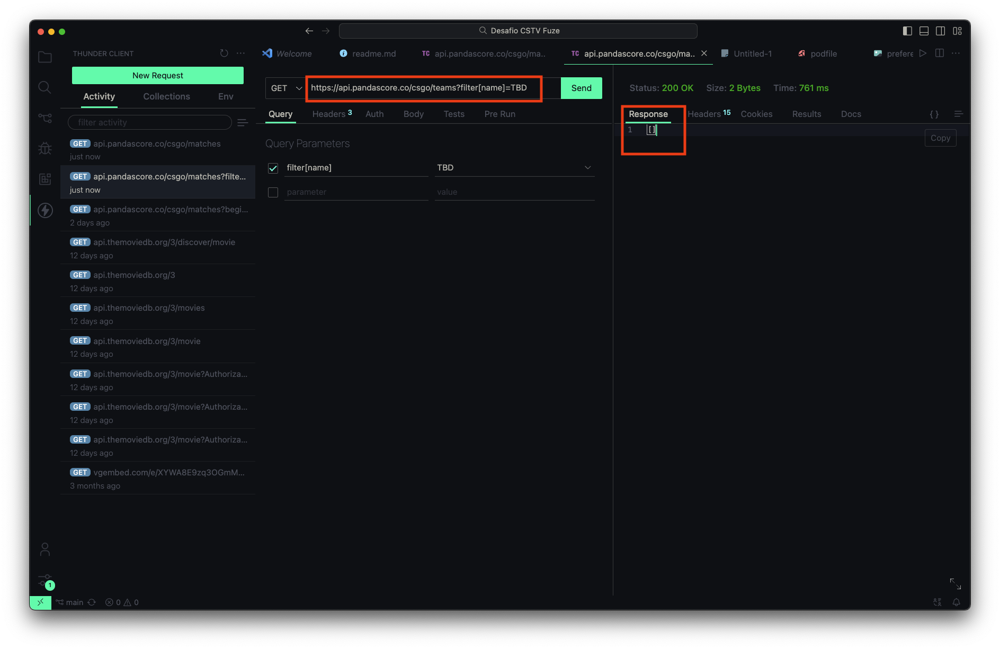

# Desafio CSTV Fuse

## Implemented Items:

 - Main app screens (Matches and details)
 - Pull down to refresh functionality
 - Sort by currently running, from current date
 - Passive error handling

 ## Extras:

 - Unit Testing
 - MVVM Architecture
 - Pagination
 - Reactive Programming (via RxSwift)
 - Responsiveness (Tested on iPhone SE 1st Gen - XCode Simulator)

 ## Also included:

 - Toggle to enable past matches. When enabled, the pagination will not filter matches that already occurred in past dates considering the current one. This toggle can be found under the device settings > Desafio CSTV Fuse

 

 ## Development environment:

 - CocoaPods: Run `pod install` on project's root folder to install CocoaPods dependencies
 - Minimum deployments: iOS 15 (compatible with iPhone SE 1st gen & iPhone 6s onwards)
 - The project was developed using XCode 15 Beta, however it's format is XCode 14-Compliant

 ## Libraries:

 - RxSwift & RxCocoa: Reactive programming
 - SwiftUI-Cached-Async-Image (Swift Package Manager): Allows to load images on match listing without hangings or unnecessary reloadings while scrolling the list.
 - OHHTTPStubs: Offline testing using JSON mocks

## Sorting algorythm

- On line 51, at `HomeViewModel`, it was decided to remove matches without the opponents attribute, since it wouldn't be possible to load informations about the matches without the attribute `id` from the team, contained in the aforementioned object.

Update (august, 7): it was later verified that PandaScore API has an endpoint that filters teams by name. However, with the only match found in that situation, only one team was both opponents (TBD vs TBD) and the API returned an empty response when filtered by it. If it was possible to filter by name and obtain a non-empty response, it could be profiled and performance-evaluated against the version without the request by name, since make a request for every match result, even with a lazy UI component, could have detrimental effects on it.

- By default, the app doesn't lists matches that occurred before the current date, since per business rule was mentioned "beginning from the current date". However, there's an user-changeable setting for togling this behavior
